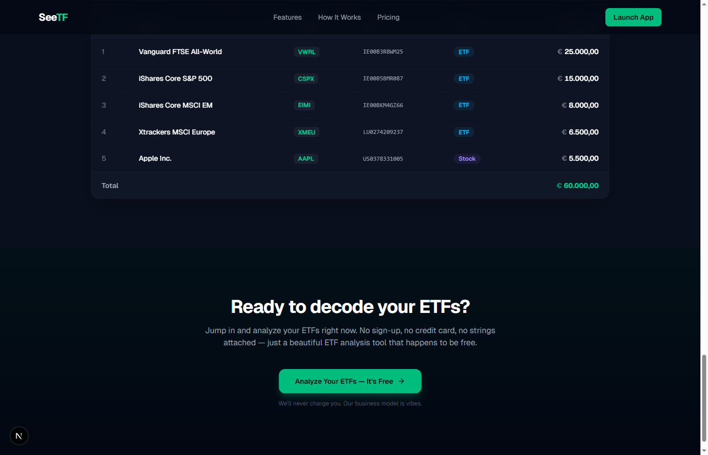
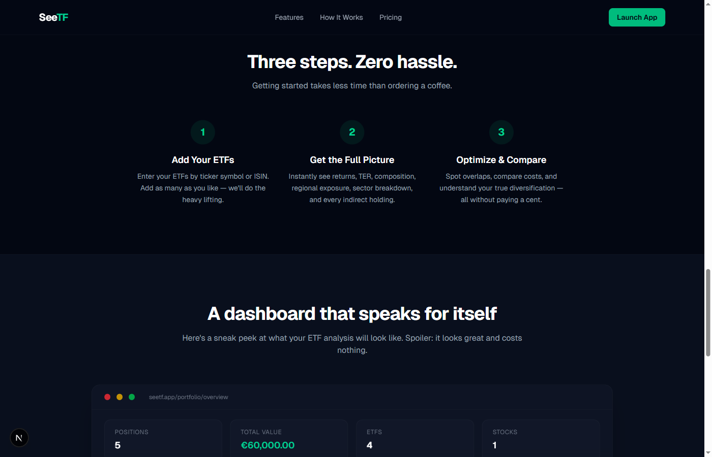

<div align="center">

# See**TF**

### Your ETFs, fully analyzed & decoded.

A free, modern ETF portfolio analyzer that breaks down your funds into their underlying holdings, country exposure, sector allocation, and performance metrics — all in one beautiful dashboard.

[](https://nextjs.org)
[](https://www.typescriptlang.org)
[](https://tailwindcss.com)
[](https://trpc.io)
[](LICENSE)

</div>

---

## ✨ What is SeeTF?

**SeeTF** is a completely free, no-login-required web app that lets you enter your ETF positions and instantly see:

- **📊 ETF Composition Breakdown** — See exactly what's inside your ETFs with full holdings data
- **📈 Returns Overview** — Compare 1Y, 3Y, and 5Y returns at a glance
- **💰 TER Comparison** — Total Expense Ratios side by side
- **🌍 Country Exposure** — Visualize geographic diversification across 40+ countries
- **🔍 Indirect Stock Holdings** — Discover every stock you indirectly own through your ETFs
- **🥧 Sector & Industry Breakdown** — Understand your true sector allocation across all funds

No sign-up. No credit card. No catch. **100% free, forever.**

---

## 🖼️ Screenshots

<div align="center">

| Landing Page | Features |
|:---:|:---:|
|  |  |

| Dashboard Preview | ETF Detail Preview |
|:---:|:---:|
|  |  |

</div>

---

## 🛠️ Tech Stack

| Technology | Purpose |
|---|---|
| **Next.js 15** | React framework with App Router |
| **TypeScript** | Type-safe development |
| **Tailwind CSS v4** | Utility-first styling |
| **tRPC** | End-to-end typesafe APIs |
| **Recharts** | Interactive pie charts & data visualization |
| **Lucide Icons** | Beautiful, consistent iconography |

---

## 🚀 Getting Started

```bash
# Clone the repository
git clone https://github.com/your-username/SeeTF.git
cd SeeTF

# Install dependencies
npm install

# Start the development server
npm run dev
```

Open [http://localhost:3000](http://localhost:3000) to see the app.

---

## 📁 Project Structure

```
src/
├── app/                    # Next.js App Router pages
│   ├── page.tsx            # Landing page
│   ├── layout.tsx          # Root layout
│   ├── etf/[isin]/         # ETF detail page (composition, returns, etc.)
│   ├── portfolio/          # Portfolio input & overview
│   └── api/trpc/           # tRPC API route handler
├── server/
│   └── api/routers/        # tRPC routers (securities, etc.)
├── trpc/                   # tRPC client configuration
├── lib/                    # Utilities (local storage, etc.)
└── styles/                 # Global CSS
```

---

## 🤖 Fully Vibecoded

This entire project was **fully vibecoded using Claude Opus 4.6**. Zero lines of code were written by hand — every component, every API route, every styling decision, and every interaction was generated through AI-assisted development.

From the landing page hero section to the ETF composition pie charts, from the tRPC API layer to the responsive dark-mode UI — it's all vibecoded. ✨

---

## 📄 License

This project is licensed under the [MIT License](LICENSE).
